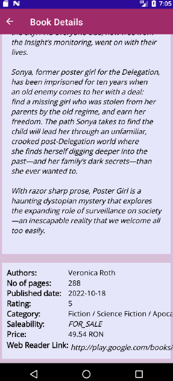

The app connects with the Google Books API and displays a list of books, offering the possibility to search through them, see the information about a specific selected book that the API offers. The app also allows the user to add a review to a specific book, mark books as favourites, display a chart representing the average rating for a selected category and contact the developers.

  
